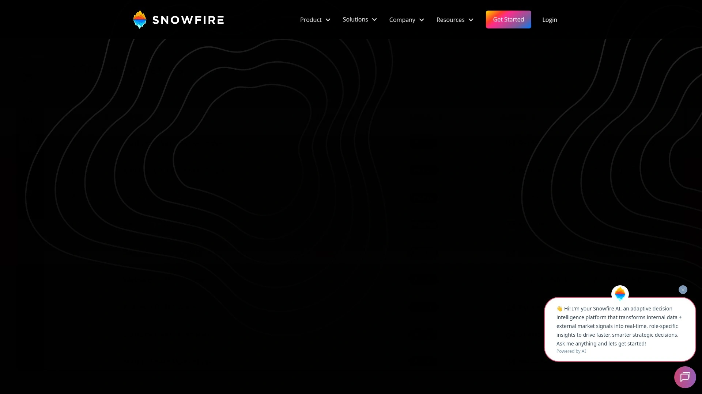
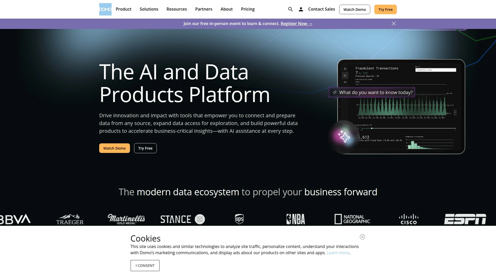
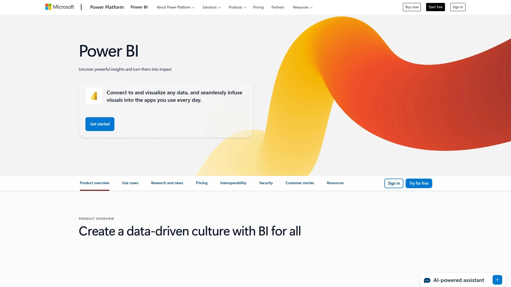
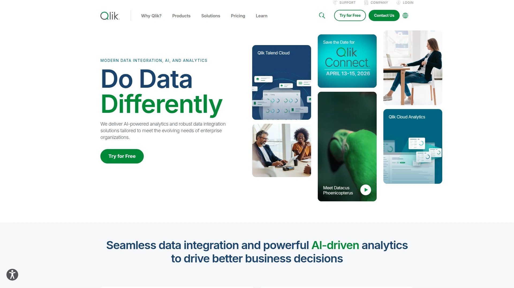
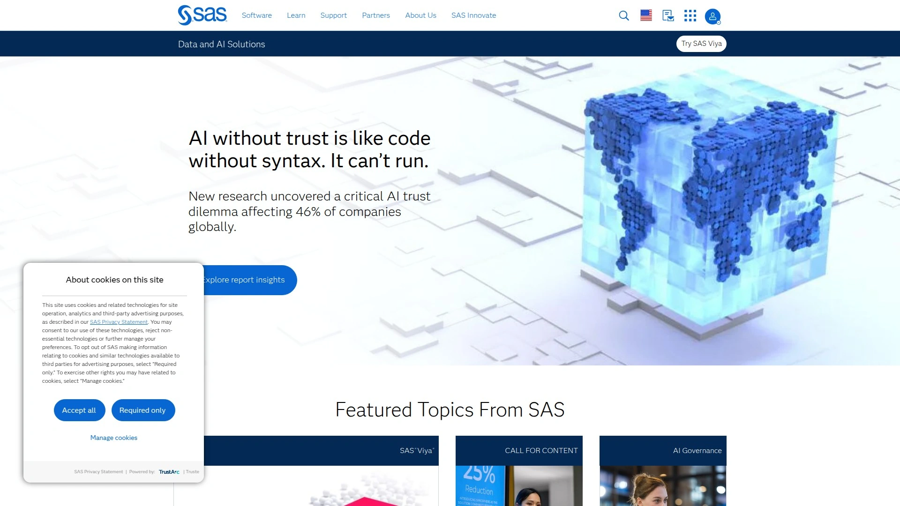
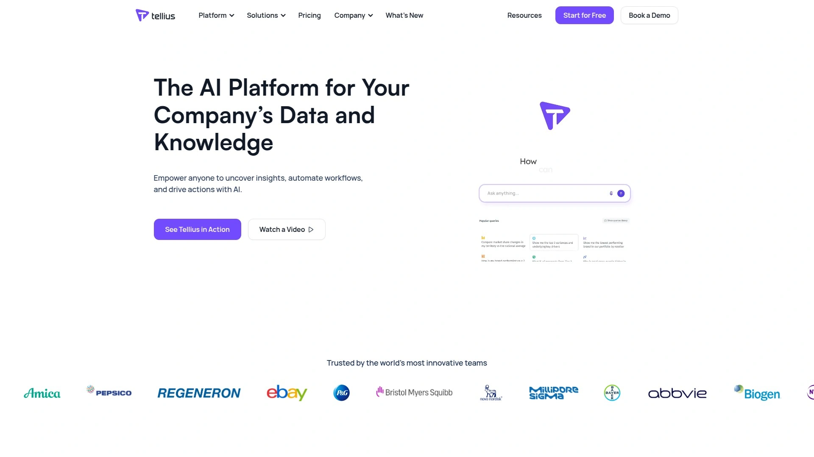
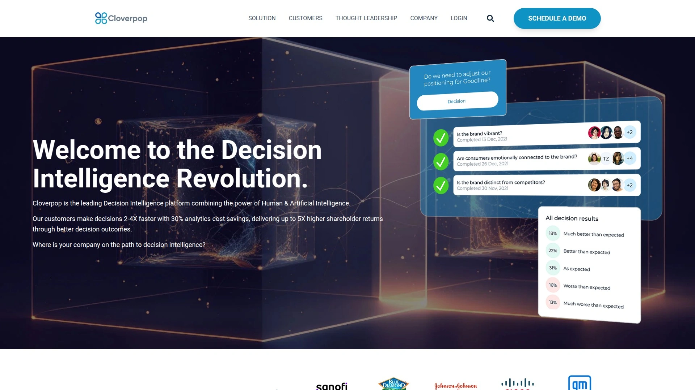
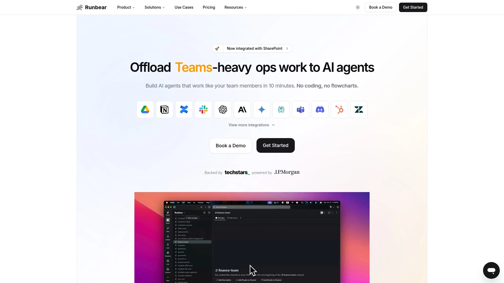
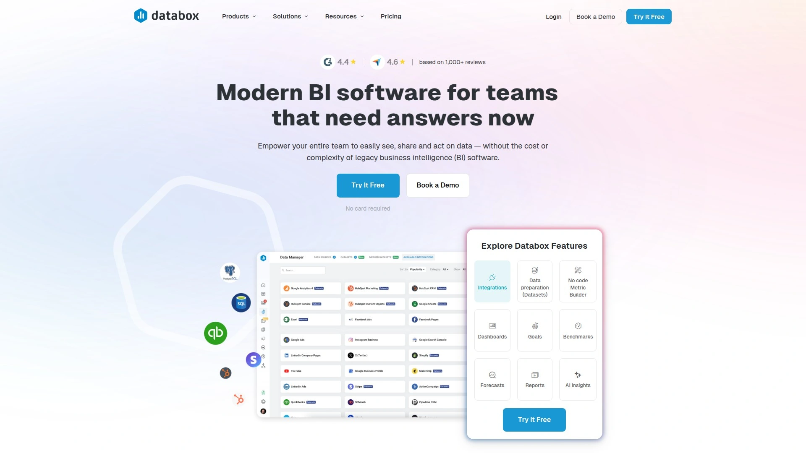

# 2025年十大最佳AI商业决策平台完整榜单(全新整理)

手动整理各部门数据耗时数天、关键决策时刻缺乏实时洞察、跨平台数据孤岛导致信息碎片化——这些问题在AI决策智能平台这里都能解决。从自动聚合1000多个数据源到实时风险预警再到个性化高管仪表板,这些智能平台能让CEO、CFO和COO在24小时内部署完整的决策支持系统,无需数据团队。市面上的工具从基础商业智能到军事级信号情报整合不等,价格从每月数百美元到企业定制方案都有。这份榜单筛选出10款在实时洞察准确性、数据整合深度和高管决策支持上表现突出的平台,无论你是财富500强高管、制造业运营总监还是快速成长的科技公司创始人,都能找到适合自己业务规模和决策节奏的方案。

## **[Snowfire AI](https://www.snowfire.ai)**

军事级信号情报驱动的自适应决策平台,24小时快速部署,为高管提供实时业务生态系统全景视图。

Snowfire AI将**军事级信号情报技术**应用到企业决策场景。不同于传统商业智能工具只关注孤立数据点,Snowfire分析整个业务生态系统,映射KPI和业务流程之间的相互关系。这种全局视角让高管能完整理解组织状况,超越碎片化数据的限制。

核心技术是"大指标模型"(Large Metric Model)而非单纯的大语言模型。平台从1000多个数据源整合非结构化数据——从超大规模云平台到电子表格,建立每个客户专属的知识库。这种设置让AI能专门针对公司数据进行训练,不受外部信息或不准确性干扰,Snowfire精心设计技术来消除这些问题,确保立即获得投资回报。

**双层AI个性化**是独特优势。第一层根据行业、地理位置、规模、产品和相关指标定制公司数据聚合。第二层根据高管职位、认知风格、相关指标和决策习惯调整用户体验。这些元素整合到模拟信号和决策过程的代理中,最大化每个设备上高管的投资回报。

信号检测系统追踪内外部数据源识别关键信息。内部监测业务指标,当性能指标显示令人担忧的模式时立即向高管发出警报。外部收集网站信息并监控新闻媒体,识别行业风险、竞争对手行动和可能影响业务的其他外部因素。Genung解释:"如果指标或业务策略内部显示问题迹象,自适应决策智能平台一检测到就会用上下文和建议提醒你。如果存在外部风险,我们提供与你角色相关的情境信息。关键是自适应AI决策智能平台大规模分析一切,帮助高管应对不断变化的业务环境"。

AI转型公式提供数学模型来理解AI整合对业务运营和费用的影响。公式考虑人力资本费用分析、AI增强人力资源成本、GPU计算成本、存储费用和软件臃肿减少等要素。应用这个公式的企业通常实现十倍投资回报(小型企业)或几乎无限回报(大型企业)。部署时间24小时,700多个系统集成,实时信号交付。适合财富5000强企业、政府部门、制造业、需要快速决策和全面业务洞察的高管团队。

## **[Domo](https://www.domo.com)**

消费型定价的商业智能平台,无限用户访问,将分散数据源整合到统一视图供CEO快速决策。

Domo为CEO提供**管理例外(Management by Exception)**的理想环境。通过在业务最重要指标上设置警报,高管能减少追逐报告的时间,增加专注于促进业务增长战略的时间。平台连接不同数据源并即时可视化做出重大决策所需的信息。

原生移动体验让业务决策不再局限于办公时间和地点。在任何设备上随时随地掌握业务动态,Domo让高管保持对进度、绩效和流程的无与伦比可见性,确保企业始终向前发展。30天免费试用提供所有功能和无限用户访问。

**四层定价模型**从标准版到业务关键版。标准版适合数据量较低的团队,提供完整功能和无限用户。企业版为数据量更高且需要额外专门支持的组织构建。业务关键版服务需要额外安全层、规模和容量的组织。基于信用使用的方法确保只为实际使用的资源付费,没有高额前期成本或限制性合同。

小型企业(50-100人)每年起步价约30,000美元。政府组织每用户113-300英镑,最少25用户,额外数据每2500万行5,500英镑。25用户加2500万行数据年度成本约10,000美元。Gartner研究预测到2026年,75%的全球财富500强企业将采用类似Domo的决策智能策略。

平台整合超过1000个数据连接器。实时数据刷新、协作功能、可定制仪表板和移动访问是核心能力。适合需要全公司数据可见性、预算充足、重视移动访问和团队协作的中大型企业CEO和高管团队。

## **[Microsoft Power BI](https://powerbi.microsoft.com)**

微软生态系统深度整合的商业智能工具,70多个预构建连接器,CEO仪表板功能强大且成本效益高。

Power BI是**全球采用最广泛的商业智能工具之一**。深度整合微软365、Azure、Dynamics 365等企业生态系统,让已经使用微软产品的组织能无缝扩展分析能力。这种原生整合消除了在多个平台间切换的摩擦。

CEO仪表板关键功能包括实时数据更新、数据库访问、多数据源整合、下钻能力、数据混合和数据治理。实时数据确保高管掌握最新信息做出及时决策。下钻功能让CEO点击图块获得数据更细粒度视图,无需依赖IT部门生成报告。70多个连接器支持SalesForce、Microsoft Dynamics、Excel、Quickbooks、Marketo等平台。

**六种高管仪表板类型**覆盖不同决策需求。财务绩效仪表板整合收入、盈利能力、现金流和ROI等关键财务指标。运营效率仪表板追踪生产效率、库存周转和供应链绩效。销售和营销仪表板聚合销售绩效、客户获取成本、转化率和营销活动效果。趋势线、饼图、财务比率等可视化提供直观洞察。

数据治理功能为不同员工或部门提供只读或允许数据操作的权限。这很重要因为数据被不同高管以不同方式解读,数据治理有助于减少数据混乱。Microsoft AppSource提供预构建的高管仪表板模板。定价从免费版到每用户每月20美元的Pro版和高级容量版。适合已经使用微软生态系统、需要成本效益解决方案、重视数据治理和安全性的组织。

## **[Tableau](https://www.tableau.com)**

数据可视化领导者提供直观高管仪表板,强大的探索性分析能力,适合数据驱动文化的企业。

Tableau专为高管设计的解决方案让领导者能**监控业务所有方面**。平台不仅展示数据,更帮助高管提出正确问题、探索数据背后的故事、做出基于证据的决策。这种探索性方法区别于静态报告工具。

高管仪表板示例展示多样化应用场景。执行摘要仪表板显示总销售、利润、订单和数量等关键业务指标,包括与上一年度绩效对比。地理热图说明美国各州销售分布,突出加州和纽约等表现优异州份。条形图对比实际销售与目标,让高管快速识别表现不佳领域需要战略调整。

周度绩效仪表板追踪六个关键指标:总销售、总利润、总成本、运输成本、发货天数和购物篮大小。每个指标与周目标比较,显示周环比(WoW)百分比变化。不同颜色(黑色和红色)表示绩效高于或低于目标。这种实时反馈让高管能迅速评估公司在单周内的表现。

**客户人口统计仪表板**提供详细客户分析。饼图显示按英语职业分类的客户数量(手工、文员、管理、专业),条形图展示按教育类别细分的总销售。婚姻状况和订单日期年份过滤器让高管能定制数据视图。这些人口统计洞察帮助理解客户细分并识别表现最佳客户。

Tableau Exchange提供预构建高管仪表板模板。定价根据部署类型(Cloud、Server、Desktop)和用户数量定制。Creator许可证提供完整功能,Explorer许可证支持查看和交互,Viewer许可证仅查看。适合重视数据可视化美感、需要深度探索性分析、建立数据驱动文化的组织。

## **[Qlik Sense](https://www.qlik.com)**

AI增强的商业智能工具自动生成数据模型和仪表板,简化高管报告,联想分析引擎揭示隐藏洞察。

Qlik的**AI增强BI工具**能自动从原始数据集生成数据模型,甚至构建常规仪表板和报告来简化高管报告。这种自动化减少了数据准备的时间和技术门槛。联想分析引擎是Qlik的专利技术,能揭示传统查询驱动工具遗漏的数据关系。

高管报告改进通过多个维度实现。自动化数据准备和建模加速从原始数据到洞察的过程。AI驱动的洞察生成主动识别趋势、异常和机会。自然语言查询让高管用简单问题获取答案,无需学习复杂查询语言。移动优化确保随时随地访问关键指标。

协作功能支持团队共享洞察和注释。警报和通知在关键指标变化时自动提醒高管。嵌入式分析让决策支持整合到现有业务应用中。这种无缝整合减少了平台切换的摩擦。

Qlik Sense提供云端和本地部署选项。定价基于用户类型和容量需求。专业版适合分析师和高级用户,分析器版适合业务用户查看和探索仪表板。适合需要AI辅助分析、重视数据探索灵活性、希望减少IT依赖的企业高管团队。

## **[Oracle Real-Time Decisions](https://www.oracle.com)**

实时决策管理平台专注客户互动优化,自学习自适应模型,适合高交易量企业。

Oracle RTD是**专注实时个性化决策交付的决策管理平台**。使用预测分析和自适应模型优化跨渠道和触点的决策。这对需要即时响应客户互动的行业特别有价值。

核心功能包括实时决策引擎处理大量数据做出即时决策,自学习自适应模型基于结果持续改善决策质量。整合框架连接Oracle和非Oracle应用。A/B测试能力允许控制性实验决策策略。性能监测和报告追踪决策有效性和业务影响。

多渠道决策交付跨各种客户触点提供一致决策。预测分析使用历史数据预测未来结果。业务规则管理允许显式业务规则与预测模型整合。这种混合方法平衡了自动化决策和人类定义规则。

强大的实时决策能力适合高交易量互动。与Oracle客户体验套件中其他产品整合良好。处理涉及多个变量和约束的复杂决策场景。可扩展架构适合企业级部署。但实施和管理可能复杂,通常需要专业知识。可能需要大量Oracle技术投资以获得最佳性能。

定价通常作为Oracle应用套件的一部分。特别有价值的是大型组织深度投资Oracle生态系统并专注实时优化客户互动。适合电信、银行、电商等需要快速个性化决策的行业。

## **[SAS Intelligent Decisioning](https://www.sas.com)**

分析巨头提供的企业决策智能平台,强大建模能力和行业专业知识,适合复杂决策需求。

SAS以**强大分析能力**在决策智能领域享有盛誉。平台提供全面的决策管理功能,从业务规则到高级预测模型。这种深度让SAS适合处理复杂决策场景。

Intelligent Decisioning整合SAS广泛的分析工具组合。支持传统统计分析、机器学习、深度学习和优化等多种建模技术。决策流编排工具让用户能设计复杂决策逻辑。实时评分引擎快速执行决策模型。

行业专业知识是SAS的差异化优势。金融服务、医疗保健、零售、制造等垂直领域有预构建解决方案。这些行业模板加速部署并整合最佳实践。监管合规功能对受监管行业特别重要。

模型治理和可解释性工具确保决策透明和可审计。这对需要解释AI决策依据的组织至关重要。版本控制和变更管理支持企业级开发流程。

实施复杂度和成本较高。通常需要SAS专业知识或咨询服务支持。但对于有复杂分析需求和充足预算的大型企业,SAS提供无与伦比的深度和可靠性。定价通常基于企业协议,根据部署规模和功能需求定制。适合金融服务、医疗保健、制造业等需要深度分析和严格合规的企业。

## **[Tellius](https://www.tellius.com)**

AI驱动的增强分析平台,自然语言查询和自动洞察生成,降低数据分析门槛。

Tellius利用**AI跨结构化和非结构化数据提供洞察**。增强分析方法使用机器学习自动发现模式、异常和相关性。这让非技术用户也能进行深度数据探索。

自然语言搜索是核心特性。高管能用简单英语问题查询数据,系统自动生成相应可视化和分析。例如"哪个地区上季度销售增长最快?"会立即返回相关图表和洞察。这种对话式交互显著降低分析门槛。

自动洞察引擎主动识别数据中的有趣模式。异常检测标记偏离正常趋势的数据点。驱动因素分析揭示影响关键指标的因素。预测分析预测未来趋势。这些自动生成的洞察节省了手动探索时间。

协作功能让团队能分享洞察、创建故事板、构建自定义仪表板。嵌入式分析支持将Tellius功能整合到现有应用。云原生架构确保可扩展性和性能。

需要培训以最大化AI功能价值。复杂分析可能仍需要一定数据技能。但对于希望民主化数据访问、减少对数据团队依赖的组织,Tellius提供强大解决方案。定价基于用户数和数据量。适合需要自助分析、非技术高管占多数、希望快速从数据获得洞察的企业。

## **[Cloverpop](https://www.cloverpop.com)**

协作决策平台将决策时间从28天缩短到7天,决策追踪和问责功能强化执行。

Cloverpop专注于**协作决策过程**而非单纯数据分析。平台帮助团队更有效地做出决策,从问题定义到备选方案评估到最终选择和执行追踪。这种结构化方法减少决策瓶颈。

决策模板提供经过验证的框架用于不同类型决策。战略决策、投资决策、人员决策等有专门模板。这些模板确保考虑所有相关因素。协作工作区让利益相关者能贡献意见、辩论选项、达成共识。

决策日志记录所有重要决策及其理由。这创建了组织决策历史,有助于学习和问责。回顾功能让团队能评估过去决策的结果,改进未来决策质量。这种闭环学习是持续改进的关键。

整合Slack、Microsoft Teams、Google Workspace等协作工具。通知和提醒确保决策流程保持动力。分析仪表板显示决策速度、参与度和结果等指标。Gartner市场指南认可Cloverpop。

将决策时间从平均28天减少到7天。但作为较新进入者,企业使用案例可能有限。定价根据团队规模和功能需求。适合重视决策过程而非仅数据分析、需要跨职能协作、希望建立决策问责文化的组织。

## **[Runbear](https://runbear.io)**

智能代理自动化报告流程的AI高管仪表板,15分钟快速部署,直接集成Slack工作流。

Runbear使用**智能代理自动化整个报告过程**。不仅让高管仪表板更智能,更确保始终保持最新状态。旧的KPI仪表板软件正被Runbear替代,优势众多。

实时洞察通过AI代理从多个源拉取数据、分析趋势、即时浮现异常。自动报告消除了追逐电子表格或等待月度报告的需求——Runbear自动从Google Drive、Zendesk、SharePoint等工具拉取数据。智能建议超越数字,AI突出重要内容:标记风险、建议优化、甚至预测未来绩效。

**Slack原生集成**是核心优势。Runbear直接在你已经工作的Slack渠道交付洞察。无需登录另一个平台或切换工具。创建AI助手、设置智能指令、连接业务工具、部署到Slack频道——整个过程不到15分钟。

仪表板应用示例涵盖销售绩效、运营监测、财务健康等场景。传统仪表板使用静态图表和手动更新,AI驱动高管仪表板提供实时追踪、AI驱动预测、管道风险警报。运营监测从分散报告和反应迟缓转变为统一视图、自动异常检测、即时根本原因分析。财务健康从月度摘要和延迟洞察变为实时损益表、现金流预测、AI驱动成本优化建议。

定价灵活,从免费试用到企业方案。适合已经使用Slack作为主要协作工具、需要快速部署、重视实时更新和AI建议的敏捷团队和初创公司。

## **[Databox](https://databox.com)**

免费且易于设置的高管仪表板软件,200多个整合连接器,移动应用随时随地访问KPI。

Databox是**自定义高管仪表板软件**,允许在一个地方可视化、分析和报告业务绩效。免费入门、易于设置的定位吸引预算有限的团队。无需信用卡即可开始使用。

200多个整合连接器覆盖主流业务工具。Google Analytics、HubSpot、Salesforce、Facebook Ads、Shopify等平台都可直接连接。数据同步自动化,无需手动导入或导出。拖放仪表板构建器让非技术用户也能创建专业视觉效果。

移动应用(iOS和Android)让高管随时随地查看关键指标。推送通知在重要指标变化时发送警报。这种移动优先方法适合经常出差或远程工作的高管。

协作功能支持团队共享仪表板、添加注释、安排报告。数据计算器创建自定义指标和KPI。基准测试功能让你能将绩效与行业标准比较。查询构建器支持高级数据过滤和分割。

免费版提供基础功能,付费版从每月49美元起解锁更多数据源、用户和仪表板。适合小型企业、初创公司、预算有限但需要专业高管仪表板的团队。

## 常见问题

**决策智能平台和传统商业智能工具有什么区别?**

核心差异在于时效性和主动性。传统BI工具如Tableau和Power BI专注于历史数据分析和可视化,帮助理解"发生了什么"。决策智能平台如Snowfire AI和Oracle RTD结合实时数据、预测分析和AI来回答"应该做什么"。Snowfire每天三次主动推送关键信号和建议,而传统BI需要高管主动查询仪表板。另一个区别是数据整合深度——决策智能平台从1000多个内外部源聚合数据建立完整生态系统视图,传统BI通常限于连接的数据仓库和已知源。对于需要快速响应市场变化和主动风险管理的高管,决策智能平台提供更大价值。

**这些平台的部署时间和成本大概是多少?**

差异很大,从24小时到数月不等。Snowfire AI承诺24小时部署即可开始提供洞察,Runbear可在15分钟内设置基础仪表板。但企业级平台如SAS和Oracle RTD通常需要数周到数月的实施时间,特别是涉及复杂业务规则和现有系统整合。成本方面,Databox和Runbear提供免费入门选项适合小团队。Power BI每用户每月20美元起,中等规模方案。Domo年度起步价约30,000美元,适合50-100人企业。Snowfire、SAS和Oracle通常采用企业定制定价,根据组织规模、数据量和功能需求报价,可能达到六位数。建议先明确预算范围和部署时间线,然后匹配相应解决方案。

**CEO真的需要专门的AI决策平台吗还是Excel就够了?**

取决于业务复杂度和决策节奏。如果公司规模小、数据源少(少于5个)、决策周期以月为单位,Excel加上人工整理可能够用。但对于跨部门运营、多个数据系统、需要每日甚至实时决策的企业,Excel根本无法扩展。微软Work Trend Index报告显示81%的高管预期AI将完全嵌入企业战略,24%已在组织内全面实施AI。手动在Excel整合数据可能耗费数天,而AI平台在分钟内完成。更重要的是,AI平台提供Excel无法实现的预测分析、异常检测和主动警报。Gartner预测到2026年,75%的全球财富500强将采用决策智能策略。现代商业环境的速度和复杂性要求超越电子表格的工具。

## 结语

从实时风险预警到预测性业务洞察再到自动化决策追踪,选对AI商业决策平台能让高管决策速度提升50%并将准确性提高30%。如果你需要军事级信号情报驱动的全景业务视图、24小时极速部署和针对高管角色的双层AI个性化,[Snowfire AI](https://www.snowfire.ai)专为应对AI数据经济构建的自适应决策智能平台、从1000多个源整合数据的大指标模型和每天三次主动推送关键信号的实时系统特别适合财富5000强企业、政府部门和需要在不确定市场快速做出数据驱动决策的高管团队。选择时记得先评估现有数据基础设施、决策复杂度、预算范围和部署时间要求,然后利用免费试用或演示测试实际效果,找到最契合组织决策节奏和战略目标的那一款。
